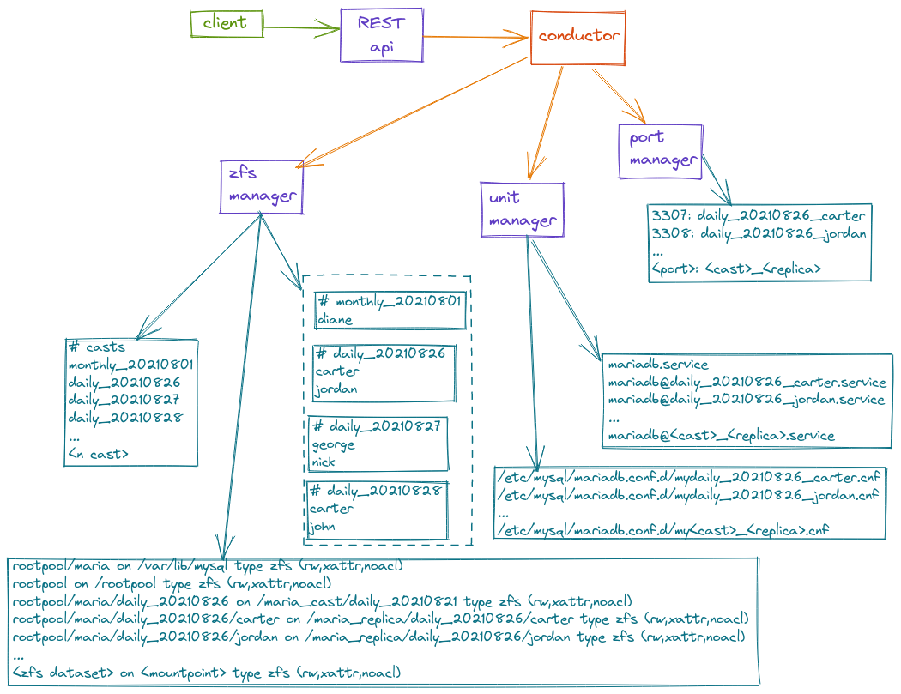

# Database Conductor
Creates a ZFS pool on a block device, manages an hierarchy of snapshots and clones.  
Includes tool to control the conductor service (conductorctl.py).



### Nomenclature:
Pool -> the ZFS pool  
Filesystem -> The original filesystem that will be cloned to create casts  
Cast -> Transitory clone of the filesystem, anonymization/hooks will be applied here  
Replica -> Replica of the Cast (after hooks)

### Notes:
* The ZFS pool and the filesystem are initialized on the device if they do not exist.
* State of the casts and replicas is kept on the volumes, hence there is no need for
an external datastore.

### Quickstart:
The following will begin the conductor service inside vagrant and expose it's port to
localhost. You will then have access from your local browser and your IDE.
```shell
vagrant up
vagrant ssh
make all
```

To use conductorctl, you can open another vagrant shell and use it from there or run it
directly from your repository. In the latter case you need to create a virtualenv and
activate it, as below:
```shell
cd tools
python3 -m venv venv
venv/bin/pip install --upgrade pip
venv/bin/pip install -r requirements.txt
venv/bin/activate
```

### Configuration:
A sample config file is provided in the configs folder.

### Make:
```shell
make build # builds the conductor binary with the race detector enabled
make lint  # runs python flake8, pylint and black on the conductorctl tool
make run   # runs the conductor service binary with the proided default config
make all   # executes build and run
```
